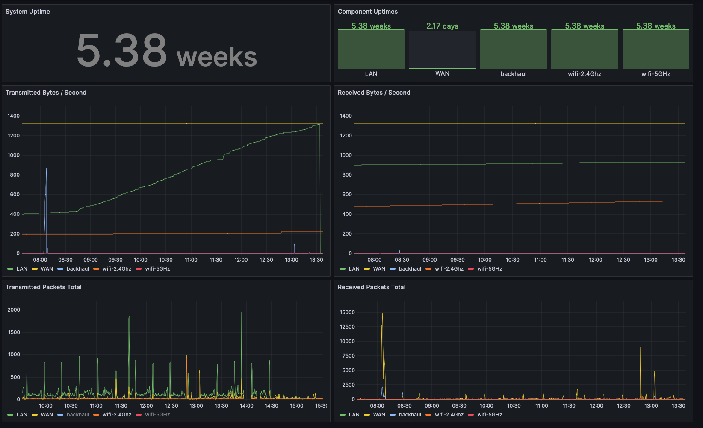

# orbi-exporter
Prometheus Exporter for Orbi Metrics



## Origin Story

My home Wi-Fi router is a Netgear Orbi RBR20, and I wanted to see what I could learn about my home network by looking at the Orbi's metrics.
It doesn't expose metrics in Prometheus format, but it does expose some network metrics via its control panel.
The control panel is a web application running on the router protected with HTTP Basic Auth. Although it responds in HTML,
the embedded javascript variables are easy to parse.

This exporter collects an Orbi router's metrics by scraping the `RST_statistic.htm` endpoint, and converts the metrics from that page into metrics in Prometheus format.

## Configuration

The exporter listens on port `6724` (on a telephone keypad, that's `O:6 R:7 B:2 I:4`)

The exporter expects the following environment variables:

```
ORBI_HOST=http://192.168.1.1
ORBI_BASICAUTH_USER=admin
ORBI_BASICAUTH_PASSWORD=<your password>
```

## Compatibility

Tested against an Orbi `RBR20`. Router Firmware Version `V2.7.4.24`. 

Other Orbi versions may not work, and other Firmware versions may not work.

See also: https://github.com/DRuggeri/netgear_exporter

## Metrics Provided

Beyond parsing the metrics, this exporter also adapts their structure to reflect Prometheus [naming conventions and recommended patterns](https://prometheus.io/docs/practices/naming/) for metrics and labels:

* metric names are prefixed with `orbi_`
* metric names contain the unit - for example, `sys_uptime` becomes `orbi_system_uptime_seconds_total`
* use a single metric name with different labels for metrics that track the same measurement but in different contexts, like "received packets". For example, `lan_rxpkts` and `wan_rxpkts` become `orbi_received_packets` with labels `component: "wan"` and `component: "lan"`

| Metric Name                         |
|-------------------------------------|
| `orbi_system_uptime_seconds_total`  |
| `orbi_uptime_seconds_total`         |
| `orbi_received_bytes_per_second`    |
| `orbi_transmitted_bytes_per_second` |
| `orbi_received_packets_total`       |
| `orbi_transmitted_packets_total`    |
| `orbi_collisions_total`             |

### Labels

* `original_metric_name`: the name of the source JavaScript variable for this metric from the `RST_statistic.htm` page
* `host`: the ip address of the router (the same value as `ORBI_HOST`)
* `component`: the network within the router for which the metric applies (values: "LAN", "WAN", "backhaul", "wifi-2.4Ghz", "wifi-5Ghz")

### Components

The exporter uses the term `component` to describe different systems or networks within the router.

| Component Name | Description                                                                                                                                                                                                                                                                       |
|----------------|-----------------------------------------------------------------------------------------------------------------------------------------------------------------------------------------------------------------------------------------------------------------------------------|
| `WAN`          | the connection between the Orbi router and the internet                                                                                                                                                                                                                           |
| `LAN`          | wired connections to the Orbi router                                                                                                                                                                                                                                              |
| `wifi-2.4Ghz`  | wireless connections on the 2.4Ghz band. 2.4Ghz has been around longer that 5Ghz, and is slower but typically has better range. The Orbi metrics call this `bgn`, because `b` `g` and `n` are the versions of the `802.11` standard that include this frequency band.             |
| `wifi-5Ghz`    | wireless connections on the 5Ghz band. 5Ghz allows faster speeds, but can have worse range than the 2.4Ghz band, and may not be supported on all devices. The Orbi metrics call this `an`, because the `a` and `n` versions of the `802.11` standard include this frequency band. | 
| `backhaul`     | the dedicated wireless communication between the primary Orbi hub and its satellites                                                                                                                                                                                              | 

## Grafana Dashboard

To get started visualizing the metrics from this exporter, you can import the grafana dashboard json file here: [grafana/Network-1714602739130.json]()

The dashboard shows device uptime, packets transmitted and received, and bytes transmitted and received.